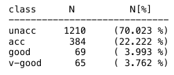

```{r setup, include=FALSE}
library(flexdashboard)
library(dplyr)
library(DT)
library(tidyverse)
library(caret)
library(rpart)
library(rpart.plot)
library(viridis)


```

# Trabajando datos

## Column {data-width="50%"}

### Exploración y transformación

::: box
De acuerdo con la información de car.names renombrarán las columnas como sigue:

-   buying = vhigh
-   maint = vhigh.1
-   doors = X2
-   persons = X2.1
-   lug_boot = small
-   safety = low
-   clase = unacc
:::

```{r include=FALSE}
df <- read.csv("C:\\Users\\eduar\\OneDrive - Instituto Tecnologico y de Estudios Superiores de Monterrey\\Tec Monterrey Adm TI M\\4. Analisis y minería de datos para la toma de desiciones\\A5\\car_dataset\\car_data.csv")

datos <- df %>%
  rename(buying= vhigh,
             maint=vhigh.1,
             doors=X2,
             persons=X2.1,
             lug_boot=small,
             safety=low,
             clase=unacc)

```

::: box
También podemos ver que la distribución de la clase no es normal:

{.responsive}

Siendo:

-   unacc = unacceptable (inaceptable)
-   acc = acceptable (aceptable)
-   good = bueno (bueno)
-   v-good = very good (muy bueno)

Los datos no contienen nulos `sum(is.na(datos))`
:::

```{r}
sum(is.na(datos))
```

::: box
Resumén de los datos usando `str(datos)`
:::

```{r}
str(datos) %>%
  knitr::kable()
```

::: box
Estas variables serán transformadas a factores para su mejor manejo.
:::

```{r}
da <- as.data.frame(unclass(datos),
                       stringsAsFactors = TRUE)
str(da) %>%
  knitr::kable()
```

::: box
Aquí termina el primer análisis y transformación de los datos
:::

## Column {data-width="50%"}

### Comprendiendo los datos

#### Porcentajes de las variables

```{r}
p0 <- da %>%
  group_by(buying)%>%
  ggplot(mapping = aes(x = fct_rev(fct_infreq(buying)))) +
  geom_bar(aes(y = (..count..)/sum(..count..)), fill = turbo(n=4))+
  scale_y_continuous(labels = scales::percent)+
  labs(x = "Precio de compras", y = "Porcentaje")+
  theme_classic()
  
p0 %>% plotly::ggplotly()
```

::: box
Como podemos ver, las compras tienen una distribución uniforme y todas se mueven alrededor del 25%. Significa que el costo de compra es igual.
:::

```{r}
p1 <- da %>%
  group_by(maint)%>%
  ggplot(mapping = aes(x = fct_rev(fct_infreq(maint)))) +
  geom_bar(aes(y = (..count..)/sum(..count..)), fill = turbo(n=4))+
  scale_y_continuous(labels = scales::percent)+
  labs(x = "Precio de mantenimiento", y = "Porcentaje")+
  theme_classic()
  
p1 %>% plotly::ggplotly()
```

::: box
Al igual que el precio de compras, el costo de mantenimiento también sigue una distribución uniforme y todas se mueven alrededor del 25%. Significa que el costo de mantenimiento es similar.
:::

```{r}
p2 <- da %>%
  group_by(doors)%>%
  ggplot(mapping = aes(x = fct_rev(fct_infreq(doors)))) +
  geom_bar(aes(y = (..count..)/sum(..count..)), fill = turbo(n=4))+
  scale_y_continuous(labels = scales::percent)+
  labs(x = "Número de puertas", y = "Porcentaje")+
  theme_classic()
  
p2 %>% plotly::ggplotly()
```

::: box
De nuevo, vemos una distribución uniform, el costo de mantenimiento también sigue una distribución uniforme y todas se mueven alrededor del 25%. Significa que existen la misma cantidad de vehiculos con diferente número de puertas.
:::

```{r}
p3 <- da %>%
  group_by(persons)%>%
  ggplot(mapping = aes(x = fct_rev(fct_infreq(persons)))) +
  geom_bar(aes(y = (..count..)/sum(..count..)), fill = turbo(n=3))+
  scale_y_continuous(labels = scales::percent)+
  labs(x = "Numero de personas", y = "Porcentaje")+
  theme_classic()
  
p3 %>% plotly::ggplotly()
```

::: box
Acá tenemos algo esperado, tenemos el mismo numero de vehiculos en cuanto a capacidad de persosna capaz de llevar.
:::

```{r}
p4 <- da %>%
  group_by(lug_boot)%>%
  ggplot(mapping = aes(x = fct_rev(fct_infreq(lug_boot)))) +
  geom_bar(aes(y = (..count..)/sum(..count..)), fill = turbo(n=3))+
  scale_y_continuous(labels = scales::percent)+
  labs(x = "Tamaño de maletero", y = "Porcentaje")+
  theme_classic()
  
p4 %>% plotly::ggplotly()
```

::: box
De misma forma, no varia
:::

```{r}
p5 <- da %>%
  group_by(safety)%>%
  ggplot(mapping = aes(x = fct_rev(fct_infreq(safety)))) +
  geom_bar(aes(y = (..count..)/sum(..count..)), fill = turbo(n=3))+
  scale_y_continuous(labels = scales::percent)+
  labs(x = "Tamaño de maletero", y = "Porcentaje")+
  theme_classic()
  
p5 %>% plotly::ggplotly()
```

::: box
Ya ni me tomaré la molestia
:::

```{r}
p6 <- da %>%
  group_by(clase)%>%
  ggplot(mapping = aes(x = fct_rev(fct_infreq(clase)))) +
  geom_bar(aes(y = (..count..)/sum(..count..)), fill = turbo(n=4))+
  scale_y_continuous(labels = scales::percent)+
  labs(x = "Tamaño de clase", y = "Porcentaje")+
  theme_classic()
  
p6 %>% plotly::ggplotly()
```

::: box
Esta parte es verdaderamente interesante, probablemente en esta variable es donde gire el analisis.

Podemos ver que a medida que la clase baja sus observaciones aumenta y a medida que la clase es mejor su porcentaje baja drasticamente a un deplorable 3%.

Nos hace preguntar, esta variable estará relacionada con la seguridad?
:::

#### Comparativas

```{r}

p7 <- da %>%
  ggplot(mapping = aes(clase , fill = safety )) +
  geom_bar(position = position_dodge()) + 
  labs(x = "Clase", y = "Conteo")+
  guides(fill = guide_legend(title = "Seguridad"))+
  scale_fill_manual(values = c(turbo(n=3)))+
  theme_classic()

p7 %>% plotly::ggplotly()
```

::: box
Como podemos apreciar, se aprecia claramente que la clase esta relacionada con la seguridad. unacc contiene más vehiculos con seguridad baja, acc contiene vehiculos con seguridad media y alta y por ultimo vgood unicamente tiene vehiculos con seguridad alta.

Otroa gran comparativa sería conocer el numero de personas relacionadas a las puertas
:::

```{r}
p8 <- da %>%
  ggplot(mapping = aes(fill=as.factor(doors),x=persons))+
  geom_density(alpha=0.3)+
  labs(x = "Personas", y = "Densidad")+
  guides(fill = guide_legend(title = "Puertas"))+
  scale_fill_manual(values = c(turbo(n=4)))

p8 %>% plotly::ggplotly()
```

# Árboles de clasificación {#sec-árboles-de-clasificación}

::: box
Antes de arrancar con el árbol, se crearan un training set y un testing set de un 70 y 30 %.

Del ejercicio anterior nos percatamos que teníamos una data bastante inestable, luego de hacer algunas investigaciones encontramos este [articulo](knitr::include_url(%22https://yihui.org%22)), por lo que estuvimos investigando formas de dividir nuestros datos y encontramos este otro [articulo](https://topepo.github.io/caret/data-splitting.html), en el cual nos dice que:

> *The function* `createDataPartition` *can be used to create balanced splits of the data. If the* `y` *argument to this function is a factor, the random sampling occurs within each class and should preserve the overall class distribution of the data. For example, to create a single 80/20% split of the iris data:*

Es por lo que esteremos usando este código.
:::

```{r}
set.seed(123)

trainIndex <- createDataPartition(da$clase, 
                                    p = .80, 
                                    list = FALSE, 
                                    times = 1)
training <- da[trainIndex, ]
testing <- da[-trainIndex, ]


```

#### Árbol

```{r}
class.tree <- rpart(clase ~ .,
                    data=training,
                    cp=0,
                    method = "class")

rpart.plot(class.tree)

```

#### Explicación y poda

::: box
Como podemos ver, nuestro árbol esta sobredimensionado, es decir es inestable.

Por defecto se poda el árbol considerando `cp = 0.01`, que puede ser adecuado en muchos casos. Sin embargo, para seleccionar el valor óptimo de este (hiper)parámetro se puede emplear validación cruzada.

En primer lugar habría que establecer `cp = 0` para construir el árbol completo, a la profundidad máxima (determinada por los valores de `minsplit` y `minbucket`, que se podrían seleccionar "a mano" dependiendo del número de observaciones o también considerándolos como hiperparámetos; esto último no está implementado en `rpart`, ni en principio en `caret`)

Posteriormente podemos emplear las funciones `printcp()` (o `plotcp()`) para obtener (representar) los valores de CP para los árboles (óptimos) de menor tamaño junto con su error de validación cruzada `xerror` (reescalado de forma que el máximo de `rel error` es 1)

Esperemos reducir la anmsiedad al árbol
:::

{.responsive}

```{r}
printcp(class.tree)

```

#### 

Error de validación cruzada (reescalado) dependiendo del parámetro de complejidad CP empleado en el ajuste del árbol de decisión.

```{r}
a <- plotcp(class.tree)
```

::: box
La tabla con los valores de las podas (óptimas, dependiendo del parámetro de complejidad) está almacenada en la componente `$cptable`
:::

```{r}
head(class.tree$cptable, 12)
```

::: box
Ahora, podemos seleccionar un valor óptimo mediante el criterio de un error estándar ([bibliografía](https://www.taylorfrancis.com/books/mono/10.1201/9781315139470/classification-regression-trees-leo-breiman)).
:::

```{r}
xerror <- class.tree$cptable[,"xerror"]
imin.xerror <- which.min(xerror)
# Valor óptimo
class.tree$cptable[imin.xerror, ]
```

#### Prune

::: box
Veamos si ya podemos reducir esa anmsiedad
:::

```{r}
cp.optim <- class.tree$cptable[which.min(class.tree$cptable[,"xerror"]),"CP"]

class.tree <- prune(class.tree, cp=cp.optim)
rpart.plot(class.tree,extra =  3,fallen.leaves = T)
```

#### Estudiando un poco el modelo

::: box
Podríamos estudiar el modelo, por ejemplo mediante el método `summary()`, que entre otras cosas muestra una medida (en porcentaje) de la importancia de las variables explicativas para la predicción de la respuesta (teniendo en cuenta todas las particiones, principales y secundarias, en las que se emplea cada variable explicativa).
:::

```{r}
importance <- class.tree$variable.importance
importance <- round(100*importance/sum(importance), 1)
importance[importance >= 1]

```

#### safety+buying+persons

```{r}
a1=rpart(formula = clase ~ (safety+buying+persons),data=training,method = "class")
rpart.plot(a1)

```

#### safety+maint+persons

```{r}
a2=rpart(formula = clase ~ (safety+maint+persons),data=training,method = "class")
rpart.plot(a2)
```

#### safety+buying+maint+persons

```{r}

a3=rpart(formula = clase ~ (safety+buying+maint+persons),data=training,method = "class")
rpart.plot(a3)
```

# Regresión

#### Matriz de confusión para training

```{r}

predtrain <- predict(class.tree, training, type = "class")

confusionMatrix(predtrain, training$clase)


```

#### Matriz de confusión para testing

```{r}

predtest <- predict(class.tree, newdata = testing, type = "class")

confusionMatrix(predtest, testing$clase)

```

#### Ajuste de modelo

::: box
Para finalizar estamos usando glm, este se usa para ajustar modelos lineales generalizados, especificados dando una descripción simbólica del predictor lineal y una descripción de la distribución de errores.
:::

```{r}
linear_regressor=glm(formula = safety~.,family=quasibinomial,data=training)
summary(linear_regressor)
```

#### Gracias
